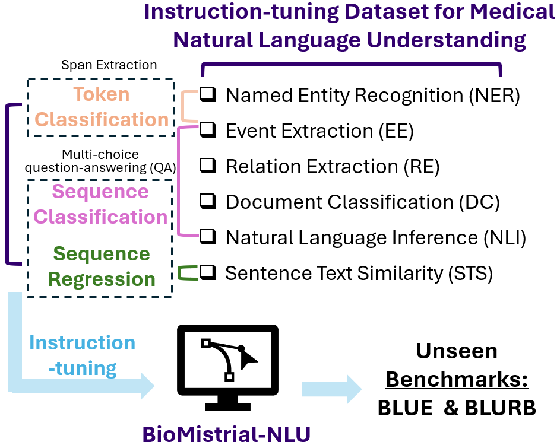

# BioMistral-NLU
Code for the paper 'BioMistral-NLU: Towards More Generalizable Medical Language Understanding through Instruction Tuning'.'



# MNLU-Instruct Dataset collection
We curate MNLU-Instruct, an instruction-tuning dataset derived from 33 publicly available medical NLU corpora, encompassing seven key medical NLU tasks. Below, we refer to the original dataset websites for downloading these datasets.

## Named Entity Recognition
1. **i2b2 2006DeID**: Uzuner ¨O, Luo Y, Szolovits P. Evaluating the state-of-the-art in automatic de-identification. Journal of the American Medical Informatics Association. 2007;14(5):550-63.
2. **i2b2 2011Coreference**: Uzuner O, Bodnari A, Shen S, Forbush T, Pestian J, South BR. Evaluating the state of the art in coreference resolution for electronic medical records. Journal of the American Medical Informatics Association. 2012;19(5):786-91.
3. **i2b2 2012Temporal**: Sun W, Rumshisky A, Uzuner O. Evaluating temporal relations in clinical text: 2012 i2b2 challenge. Journal of the American
Medical Informatics Association. 2013;20(5):806-13.
4. **i2b2 2014 DeID**: Stubbs A, Uzuner ¨O. Annotating longitudinal clinical narratives for de-identification: The 2014 i2b2/UTHealth corpus. Journal of biomedical informatics. 2015;58:S20-9.
5. **GENIA**: Yu J, Bohnet B, Poesio M. Named entity recognition as dependency parsing. arXiv preprint arXiv:200507150. 2020.
6. **linnaeus**: Kocaman V, Talby D. Biomedical named entity recognition at scale. In: Pattern Recognition. ICPR International Workshops and Challenges: Virtual Event, January 10–15, 2021, Proceedings, Part I. Springer; 2021. p. 635-46.
7. **tmVar**:Wei CH, Phan L, Feltz J, Maiti R, Hefferon T, Lu Z. tmVar 2.0: integrating genomic variant information from literature with dbSNP and ClinVar for precision medicine. Bioinformatics. 2018;34(1):80-7.
8. **DrugProt**: Miranda-Escalada A, Mehryary F, Luoma J, Estrada-Zavala D, Gasco L, Pyysalo S, et al. Overview of DrugProt task at BioCreative VII: data and methods for large-scale text mining and knowledge graph generation of heterogenous chemical–protein relations. Database. 2023;2023:baad080.
9. **BioRed**: Luo L, Lai PT, Wei CH, Arighi CN, Lu Z. BioRED: a rich biomedical relation extraction dataset. Briefings in Bioinformatics. 2022;23(5):bbac282.
11. **GNorm**: Morgan AA, Lu Z, Wang X, Cohen AM, Fluck J, Ruch P, et al. Overview of BioCreative II gene normalization. Genome
biology. 2008;9:1-19.
12. **NLM-Gene**: Islamaj R, Wei CH, Cissel D, Miliaras N, Printseva O, Rodionov O, et al. NLM-Gene, a richly annotated gold standard dataset for gene entities that addresses ambiguity and multi-species gene recognition. Journal of biomedical informatics. 2021;118:103779.
13. **ClinicalIE**: Agrawal M, Hegselmann S, Lang H, Kim Y, Sontag D. Large Language Models are Few-Shot Clinical Information Extractors.
14. **BC4CHEMD**: Krallinger M, Rabal O, Leitner F, Vazquez M, Salgado D, Lu Z, et al. The CHEMDNER corpus of chemicals and drugs and its annotation principles. Journal of cheminformatics. 2015;7:1-17.
15. **PubMed PICO**: Jin D, Szolovits P. Pico element detection in medical text via long short-term memory neural networks. In: Proceedings of the
BioNLP 2018 workshop; 2018. p. 67-75.
16. **PICO-Data**: Nguyen AT, Wallace BC, Li JJ, Nenkova A, Lease M. Aggregating and predicting sequence labels from crowd annotations. In: Proceedings of the conference. Association for Computational Linguistics. Meeting. vol. 2017. NIH Public Access; 2017. p. 299.

## Event Extraction
1. **i2b2 2009Medication**: Uzuner ¨O, Solti I, Cadag E. Extracting medication information from clinical text. Journal of the American Medical Informatics
2.  **i2b2 2018ADE**: Henry S, Buchan K, Filannino M, Stubbs A, Uzuner O. 2018 n2c2 shared task on adverse drug events and medication extraction in electronic health records. Journal of the American Medical Informatics Association. 2020;27(1):3-12. 
3.  **n2c2 2022SDoH**: Lybarger K, Yetisgen M, Uzuner ¨O. The 2022 n2c2/UW shared task on extracting social determinants of health. Journal of the American Medical Informatics Association. 2023;30(8):1367-78.

## Document Classification 
1. **i2b2 2006Smoking**: Uzuner ¨O, Goldstein I, Luo Y, Kohane I. Identifying patient smoking status from medical discharge records. Journal of the American Medical Informatics Association. 2008;15(1):14-24.
2. **i2b2 2008Obesity**: Uzuner ¨O. Recognizing obesity and comorbidities in sparse data. Journal of the American Medical Informatics Association. 2009;16(4):561-70.
3. **n2c2 2018**: Stubbs A, Filannino M, Soysal E, Henry S, Uzuner ¨O. Cohort selection for clinical trials: n2c2 2018 shared task track 1. Journal of the American Medical Informatics Association. 2019;26(11):1163-71.
4. **2024 SemEval Task 2**: Jullien M, Valentino M, Freitas A. SemEval-2024 task 2: Safe biomedical natural language inference for clinical trials. arXiv preprint arXiv:240404963. 2024.
5. **TrialStop**: Razuvayevskaya O, Lopez I, Dunham I, Ochoa D. Why clinical trials stop: the role of genetics. medRxiv. 2023:2023-02.
6. **MTSamples**: Welcome to MTSamples; 2023. Accessed: 2024-6-8. https://mtsamples.com/.

## Relation Extraciton
1. **i2b2 2011Coreference**: Uzuner O, Bodnari A, Shen S, Forbush T, Pestian J, South BR. Evaluating the state of the art in coreference resolution for electronic medical records. Journal of the American Medical Informatics Association. 2012;19(5):786-91.
2. **i2b2 2012Temporal**: Sun W, Rumshisky A, Uzuner O. Evaluating temporal relations in clinical text: 2012 i2b2 challenge. Journal of the American Medical Informatics Association. 2013;20(5):806-13.
3. **EUADR**: van Mulligen EM, Fourrier-Reglat A, Gurwitz D, Molokhia M, Nieto A, Trifiro G, et al. The EU-ADR corpus: Annotated drugs, diseases, targets, and their relationships. Journal of Biomedical Informatics. 2012;45(5):879-84. Text Mining and Nat- ural Language Processing in Pharmacogenomics. Available from: https://www.sciencedirect.com/science/ article/pii/S1532046412000573.
4. **DrugProt**: Miranda-Escalada A, Mehryary F, Luoma J, Estrada-Zavala D, Gasco L, Pyysalo S, et al. Overview of DrugProt task at BioCreative VII: data and methods for large-scale text mining and knowledge graph generation of heterogenous chemical– protein relations. Database. 2023;2023:baad080.
5. **BioRed**: Luo L, Lai PT, Wei CH, Arighi CN, Lu Z. BioRED: a rich biomedical relation extraction dataset. Briefings in Bioinformatics. 2022;23(5):bbac282.

## Natural Language Inference (NLI)
1. **BioNLI**: Bastan M, Surdeanu M, Balasubramanian N. BioNLI: Generating a Biomedical NLI Dataset Using Lexico-semantic Con- straints for Adversarial Examples. In: Findings of the Association for Computational Linguistics: EMNLP 2022; 2022. p. 5093-104.
2. **SNLI**: Bowman SR, Angeli G, Potts C, Manning CD. A large annotated corpus for learning natural language inference. arXiv preprint arXiv:150805326. 2015.
3. **Multi-NLI**:  Williams A, Nangia N, Bowman S. A Broad-Coverage Challenge Corpus for Sentence Understanding through Inference. In: Proceedings of the 2018 Conference of the North American Chapter of the Association for Computational Linguistics: Human Language Technologies, Volume 1 (Long Papers). Association for Computational Linguistics; 2018. p. 1112-22. Available from: http://aclweb.org/anthology/N18-1101.

## Semantic Text Similarity (STS)
1. **SIS-B**: Wang A, Singh A, Michael J, Hill F, Levy O, Bowman SR. GLUE: A multi-task benchmark and analysis platform for natural language understanding. arXiv preprint arXiv:180407461. 2018.

## Summarization
1. **PubMedSum**: Cohan A, Dernoncourt F, Kim DS, Bui T, Kim S, Chang W, et al. A Discourse-Aware Attention Model for Abstractive Sum- marization of Long Documents. In: Proceedings of the 2018 Conference of the North American Chapter of the Association for Computational Linguistics: Human Language Technologies, Volume 2 (Short Papers). New Orleans, Louisiana: Association for Computational Linguistics; 2018. p. 615-21. Available from: https://aclanthology.org/N18-2097.
2. **CDSR**: Guo Y, Qiu W, Wang Y, Cohen T. Automated lay language summarization of biomedical scientific reviews. In: Proceedings
of the AAAI Conference on Artificial Intelligence. vol. 35; 2021. p. 160-8.
3. **AciDemo**:  Yim Ww, Fu Y, Ben Abacha A, Snider N, Lin T, Yetisgen M. Aci-bench: a novel ambient clinical intelligence dataset for benchmarking automatic visit note generation. Scientific Data. 2023;10(1):586.

# Instruction fine-tuning on MNLU-Instruct Dataset
1. We first conduct the full-paramter fine-tuning on [BioMistral-7B-DARE](https://huggingface.co/BioMistral/BioMistral-7B-DARE), using the package [alignment-handbook](https://github.com/huggingface/alignment-handbook/tree/main/scripts). Our configurations can be found in the script *config_full.yaml*.
2. We then merge the fine-tuned model with the original BioMistral-7B-DARE, using this package, [MergeLM](https://github.com/yule-BUAA/MergeLM/tree/main). After downloading this package, we need to specify the path of our trained model:
```console
task_model_mapping_dict = {
    "instruct": "BioMistral/BioMistral-7B-DARE"
    'math': "Path_to_our_fine_tuned_model"
}

finetuned_model_backbone_mapping_dict = {
    "BioMistral/BioMistral-7B-DARE": "BioMistral/BioMistral-7B-DARE",
   "Path_to_our_fine_tuned_model":"BioMistral/BioMistral-7B-DARE",
}
```
3. Now, we can merge those models using the following command.
```console
python merge_llms_instruct_math_code.py --merge_math --merge_instruct \
        --merging_method_name mask_merging --use_weight_rescale \
        --weight_mask_rate 0.2 \
        --mask_apply_method average_merging \
        --tensor_parallel_size 1 
```

# Model Inference and Performance  Evaluation
We conduct 0-shot evaluation of our BioMistral-NLU on two public benchmarks:
1. **BLUE**: Peng Y, Yan S, Lu Z. Transfer Learning in Biomedical Natural Language Processing: An Evaluation of BERT and ELMo on Ten Benchmarking Datasets. BioNLP 2019. 2019:58.
2. **BLURB**: Gu Y, Tinn R, Cheng H, Lucas M, Usuyama N, Liu X, et al. Domain-specific language model pretraining for biomedical natural language processing. ACM Transactions on Computing for Healthcare (HEALTH). 2021;3(1):1-23. ([link](https://microsoft.github.io/BLURB/))

We conduct the model inference with the package [vllm](https://github.com/vllm-project/vllm). The performance is calculated afterward. Our code for model inference and performance evaluation is in *evaluation.py*

# Citation
Please cite our work as
```console
@inproceedings{fu2025biomistral,
  author    = {Yujuan Velvin Fu and Giridhar Kaushik Ramachandran and Namu Park and Kevin Lybarger and Fei Xia and {\"O}zlem Uzuner and Meliha Yetisgen},
  title     = {BioMistral-NLU: Towards More Generalizable Medical Language Understanding through Instruction Tuning},
  booktitle = {Proceedings of the AMIA 2025 Informatics Summit},
  year      = {2025},
  url = {https://arxiv.org/pdf/2410.18955},
}
```

